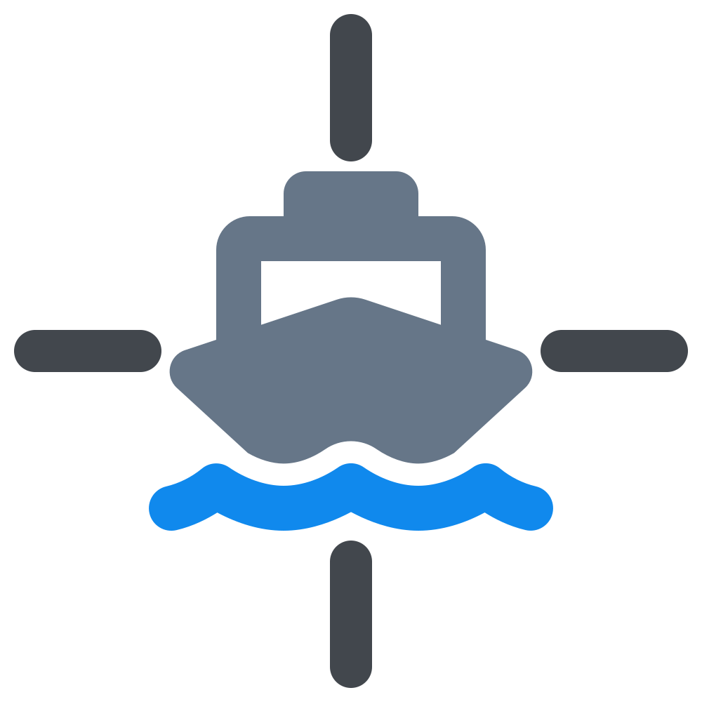
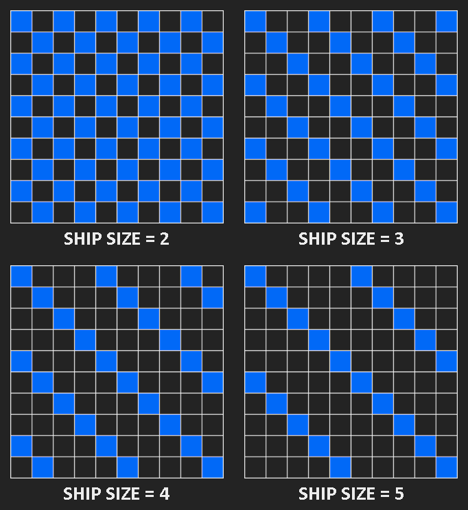

<!-- SHIELDS -->

[![Contributors][contributors-shield]][contributors-url]
[![Stargazers][stars-shield]][stars-url]
[![Issues][issues-shield]][issues-url]
[![MIT License][license-shield]][license-url]

<!-- PROJECT LOGO -->
 

<h3 align="center">Battleship AI</h3>
    

        A Battleship-playing algorithm with different levels of complexity.
         
        <a href="https://example.org/">View Demo</a>
        ·
        <a href="https://github.com/Riki9811/battleship-ai/issues">Report Bug</a>
        ·
        <a href="https://github.com/Riki9811/battleship-ai/issues">Request Feature</a>
         
    

<!-- TABLE OF CONTENTS -->

    
Table of Contents

    <ol>
        <li><a href="#about-the-project">About The Project</a></li>
        <li><a href="#strategies">Strategies</a></li>
        <li><a href="#built-with">Built With</a></li>
        <li><a href="#roadmap">Roadmap</a></li>
        <li><a href="#contributing">Contributing</a></li>
        <li><a href="#license">License</a></li>
        <li><a href="#contact">Contact</a></li>
    </ol>

 

<!-- ABOUT THE PROJECT -->

## About The Project

[![Website Screen Shot][product-screenshot]](https://example.org/)

This Git repository hosts a versatile Battleship-playing algorithm that offers multiple complexity levels.
Inspired by the video <a href="https://www.youtube.com/watch?v=8FctDuTfcO8">"How to 'always' win at Battleship?"</a> from Digital Genius and enriched by insights from <a href="http://www.datagenetics.com/blog/december32011/">DataGenetics' blog</a>.

(<a href="#top">back to top</a>)

<!-- ABOUT THE PROJECT -->

### Strategies

The algorithm will have 4 different strategies:

1. Random
2. Hunt & Target
3. Parity
4. Probability Density Function (PDF)

If you're interested in a full explanation of these strategies you can read an in depth description on <a href="http://www.datagenetics.com/blog/december32011/">this DataGenetics' blog page</a>, but the gist of it is:

- In `Random` mode the algorithm simply takes random shots each time without any strategy.

- With `Hunt & Target` the AI starts in hunting mode (where it fires at random) and once it hits a ship it'll go into target mode (where it tries to sink the ship it has found).

- The `Parity` strategy follows the same behaviour as the previous one with an improvement in the hunting phase: using parity it reduces the amount of cells it needs to consider during hunting. This strategy is a bit different than the one described by DataGenetics' blog. (<a href="#improved-parity">read more here</a>)

- The `PDF` strategy determines the best location to fire at next calculating a filed of probabilities that represents for each cell how likely it is that it contains a ship, and then shooting at the cell with the heighest probability.

 

**A better `Parity` strategy:** 
The parity strategy described by DataGenetics' blog is restricted to an even-odd parity filter because they don't use the information of which ships are still alive on the enemy's board. 
With that information the parity limit can be improved, the filter will only need to consider the cells with index divisible by the size of the smallest ship alive. 
This way at the start the parity filter is the same as the even-odd one but as soon as the small ship is sunken the filter can be updated and the number of cells that need checking will decrease once more, and so on.

Here is an example of the parity filters for each of the ships sizes:

Note how on every filter example there is no way to place a ship with the given size without it touching one of the blue cells.

(<a href="#top">back to top</a>)

<!-- BUILT WITH -->

### Built With

-   [Vite.js](https://vitejs.dev/)
-   [React.js](https://reactjs.org/)
-   [Typescript](https://www.typescriptlang.org/)
-   [Sass](https://sass-lang.com/)

(<a href="#top">back to top</a>)

<!-- ROADMAP -->

## Roadmap

-   [ ] Build game boards
-   [ ] Ability to place the ships in the boards
-   [ ] Ability to show/hide enemy's board
-   [ ] Random algorithm
-   [ ] Hunt & Target algorithm
-   [ ] Parity algorithm
-   [ ] PDF algorithm
-   [ ] Ability to select which algorithm the AI opponent should use
-   [ ] Show the 'thinking progress' of the AI opponent

See the [open issues](https://github.com/Riki9811/battleship-ai/issues) for a full list of proposed features (and known issues).

(<a href="#top">back to top</a>)

<!-- CONTRIBUTING -->

## Contributing

Contributions are what make the open source community such an amazing place to learn, inspire, and create. Any contributions you make are **greatly appreciated**.

If you have a suggestion that would make this better, you can simply open an issue with the tag "enhancement". Don't forget to give the project a star! Thanks again!

(<a href="#top">back to top</a>)

<!-- LICENSE -->

## License

Distributed under the MIT License. See `LICENSE.txt` for more information.

(<a href="#top">back to top</a>)

<!-- CONTACT -->

## Contact

Riccardo Mariotti - riccardo.mariotti98@gmail.com

Project Link: [https://github.com/Riki9811/battleship-ai](https://github.com/Riki9811/battleship-ai)

Online demo: [https://battleship-ai-riki.vercel.app/](https://example.org/)

(<a href="#top">back to top</a>)

<!-- MARKDOWN LINKS & IMAGES -->

[contributors-shield]: https://img.shields.io/github/contributors/Riki9811/battleship-ai.svg?style=for-the-badge
[contributors-url]: https://github.com/Riki9811/battleship-ai/graphs/contributors

[stars-shield]: https://img.shields.io/github/stars/Riki9811/battleship-ai.svg?style=for-the-badge
[stars-url]: https://github.com/Riki9811/battleship-ai/stargazers

[issues-shield]: https://img.shields.io/github/issues/Riki9811/battleship-ai.svg?style=for-the-badge
[issues-url]: https://github.com/Riki9811/battleship-ai/issues

[license-shield]: https://img.shields.io/github/license/Riki9811/battleship-ai.svg?style=for-the-badge
[license-url]: https://github.com/Riki9811/battleship-ai/blob/master/LICENSE.txt

[product-screenshot]: src/assets/screenshot.png
[parity-filters-screenshot]: src/assets/parity-filters.png
